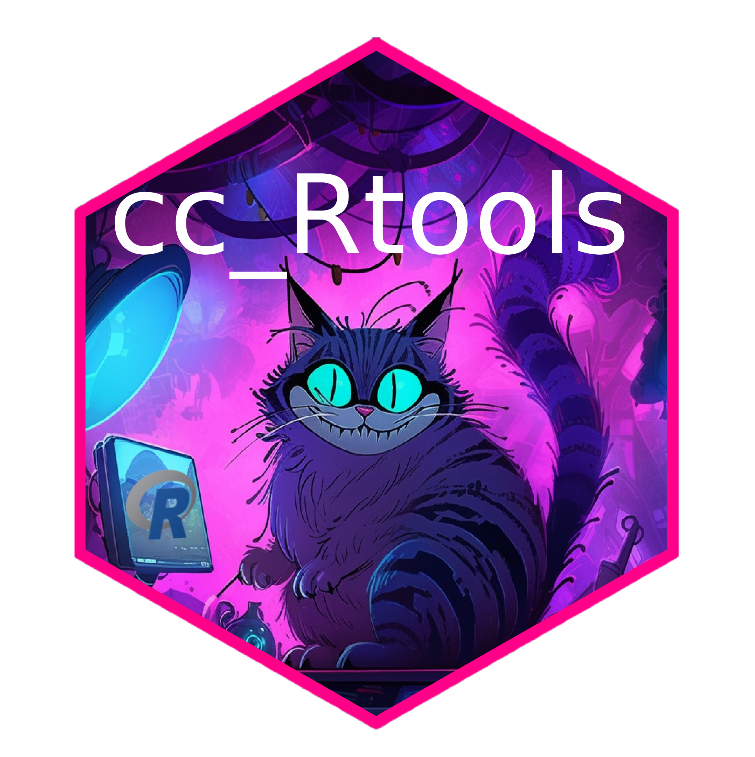

# cc_Rtools 
This plugin allows the [Cheshire Cat](https://github.com/cheshire-cat-ai/core) to use tools written in R language

(and to run R code, in general)

## Installation

- Just download the ```cc_Rtools``` folder into ```cheshire-cat/core/cat/plugins``` in your machine.
  
## Add R container to cheshire-cat

Simply add to the cat's default docker-compose.yml the following code:

```yaml
  r-env:
     build: https://github.com/dejan94it/cc_Rtools.git#main:plumber_container
     container_name: r_env
     expose:
      - "5079:5000"
     restart: unless-stopped
```
and obviously run ```docker compose up``` again, to add the new container to the network.

You can look at the whole ```docker.compose.yaml``` as example. You can also use it directly, but be sure that the original one is the same for the core part.

## How to use it

- Write a ```yourscript.R``` file and put it into ```cc_Rtools``` folder.
- Add a @tool in ```Rtools.py``` using ```run_Rtool(R_url, "yourscript.R")``` in it.

You can look at the example of ```today.R``` tool, already present in the folder.

## Plus
- You can install all the R packages you need to run your custom tools, just modifying the Dockerfile.
- You can add other endpoints (and documentation) in ```plumber.R``` file.
  
Enjoy, and obviously, contribute! :)

Ciao Piero ❤️
